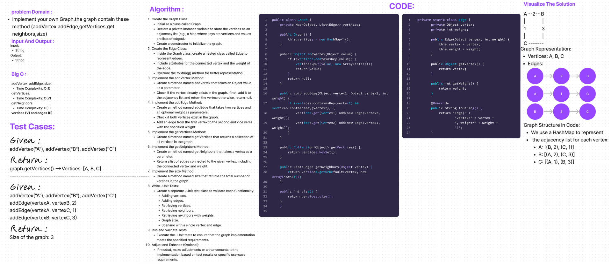

# Code Challenge: Class 35: Graph Implementation
Implement a graph in Java using adjacency list representation, supporting vertex addition, edge creation, vertex retrieval, neighbor retrieval with weights, and size determination. JUnit tests validate the functionality, emphasizing modularity and clarity.

## Whiteboard Process

## Approach & Efficiency
Approach
The approach involves implementing a graph using an adjacency list. The Graph class is designed to support adding vertices and edges, retrieving vertices and neighbors, and determining the size of the graph. The graph is represented using a HashMap for efficient storage and retrieval, and a nested Edge class is used to represent edges with associated weights.

Efficiency
Time Complexity:

Adding vertices and edges: O(1) on average, as it involves HashMap operations.
Retrieving vertices: O(V), where V is the number of vertices.
Retrieving neighbors: O(E), where E is the number of edges connected to a vertex.
Determining the size: O(1).
Space Complexity:

O(V + E), where V is the number of vertices and E is the number of edges. The primary space is consumed by the HashMap storing vertices and their adjacency lists, and the Edge class instances representing edges.
## Solution
```
public class Graph {
    private Map<Object, List<Edge>> vertices;

    public Graph() {
        this.vertices = new HashMap<>();
    }

    public Object addVertex(Object value) {
        if (!vertices.containsKey(value)) {
            vertices.put(value, new ArrayList<>());
            return value;
        }
        return null;
    }

    public void addEdge(Object vertex1, Object vertex2, int weight) {
        if (vertices.containsKey(vertex1) && vertices.containsKey(vertex2)) {
            vertices.get(vertex1).add(new Edge(vertex2, weight));
            vertices.get(vertex2).add(new Edge(vertex1, weight));
        }
    }

    public Collection<Object> getVertices() {
        return vertices.keySet();
    }

    public List<Edge> getNeighbors(Object vertex) {
        return vertices.getOrDefault(vertex, new ArrayList<>());
    }

    public int size() {
        return vertices.size();
    }

    private static class Edge {
        private Object vertex;
        private int weight;

        public Edge(Object vertex, int weight) {
            this.vertex = vertex;
            this.weight = weight;
        }

        public Object getVertex() {
            return vertex;
        }

        public int getWeight() {
            return weight;
        }

        @Override
        public String toString() {
            return "Edge{" +
                    "vertex=" + vertex +
                    ", weight=" + weight +
                    '}';
        }
    }
```
