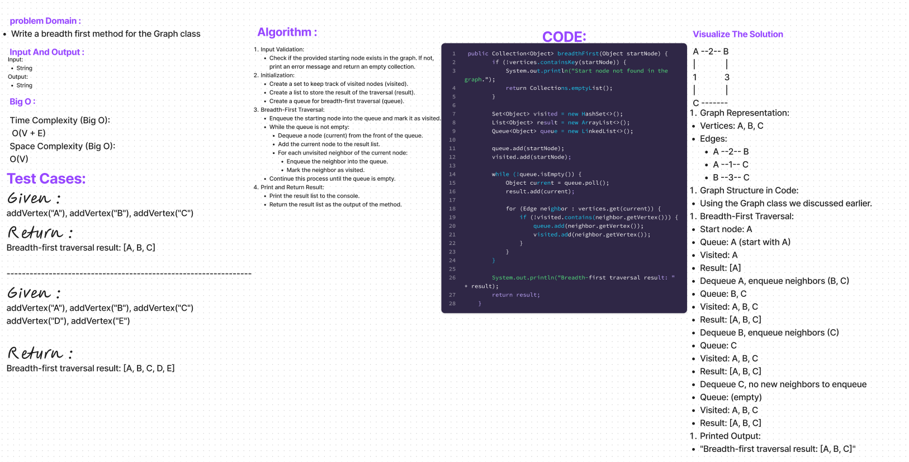

# Code Challenge: Class 36
The breadthFirst method in the Graph class performs a breadth-first traversal starting from a specified node in the graph. It utilizes a queue to explore neighbors level by level, marking visited nodes to avoid duplicates. 
## Whiteboard Process

## Approach & Efficiency
Approach
The breadthFirst method uses a breadth-first traversal approach, exploring nodes level by level. It employs a queue to manage the order of exploration, ensuring that all neighbors of the current node at one level are visited before moving on to the next level. The method utilizes a HashSet to track visited nodes and avoids revisiting them.

Efficiency
Time Complexity:

The time complexity of the breadthFirst method is O(V + E), where V is the number of vertices and E is the number of edges in the graph. The method visits each vertex and edge once during the traversal.
Space Complexity:

The space complexity is O(V) due to the usage of additional data structures such as the HashSet (visited) and the LinkedList (queue). In the worst case, when all nodes are enqueued, the space required is proportional to the number of vertices in the graph.

## Solution
```
 public Collection<Object> breadthFirst(Object startNode) {
        if (!vertices.containsKey(startNode)) {
            System.out.println("Start node not found in the graph.");
            return Collections.emptyList();
        }

        Set<Object> visited = new HashSet<>();
        List<Object> result = new ArrayList<>();
        Queue<Object> queue = new LinkedList<>();

        queue.add(startNode);
        visited.add(startNode);

        while (!queue.isEmpty()) {
            Object current = queue.poll();
            result.add(current);

            for (Edge neighbor : vertices.get(current)) {
                if (!visited.contains(neighbor.getVertex())) {
                    queue.add(neighbor.getVertex());
                    visited.add(neighbor.getVertex());
                }
            }
        }

        System.out.println("Breadth-first traversal result: " + result);
        return result;
    }
```