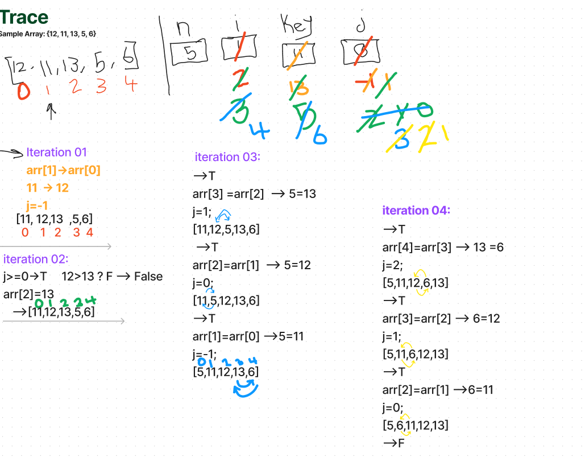

# Insertion Sort
The Insertion Sort algorithm is a method for arranging elements in ascending order. It starts by assuming the first element is already sorted. The algorithm then iterates through the unsorted part of the array, comparing each element to the elements on its left. If it finds an element smaller than itself, it shifts that element to the right to make space for insertion. This process continues until the entire array is sorted.

# pseudocode
Start
insertionSort(int[] arr)
Declare n -> arr.length;
FOR i = 1; i to n
Declare key -> arr[i];
Declare j -> i - 1;
while j >= 0 and arr[j] > key
arr[j+1] -> arr[j];
j -> j - 1;
arr[j+1] -> key;
End

# Trace 

# Efficency
Time Complexity:

Worst-case: O(n^2) 
Average-case: O(n^2) 
Best-case: O(n)

Space Complexity:

O(1)