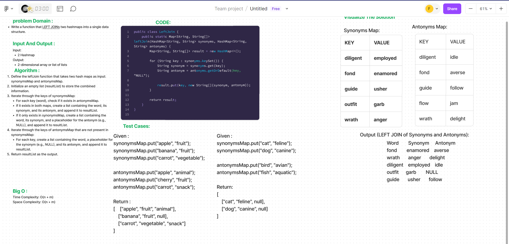

# Code Challenge: Class 33
A left join method is a function that combines two sets of data based on a specified condition. In this context, it's often used with hash maps or tables.


## Whiteboard Process


## Approach & Efficiency
Here's the step-by-step algorithm:

Initialize an empty list to store the results.
Iterate through the keys of the first hash map.
For each key, check if it exists in the second hash map.
If it does, add the key and both values to the result list.
If not, add the key and NULL for the second value.
Return the resulting list.
Time Complexity
The time complexity of this approach is O(n), where n is the number of keys in the first hash map. This is because we iterate through the keys once, and the lookup operation for keys in a hash map is O(1) on average.

Space Complexity
The space complexity is O(n), as we create a list to store the results, which can potentially contain all the keys from the first hash map.

## Solution
```
public static Map<String, String[]> leftJoin(HashMap<String, String> synonyms, HashMap<String, String> antonyms) {
        Map<String, String[]> result = new HashMap<>();

        for (String key : synonyms.keySet()) {
            String synonym = synonyms.get(key);
            String antonym = antonyms.getOrDefault(key, "NULL");

            result.put(key, new String[]{synonym, antonym});
        }

        return result;
    }
```