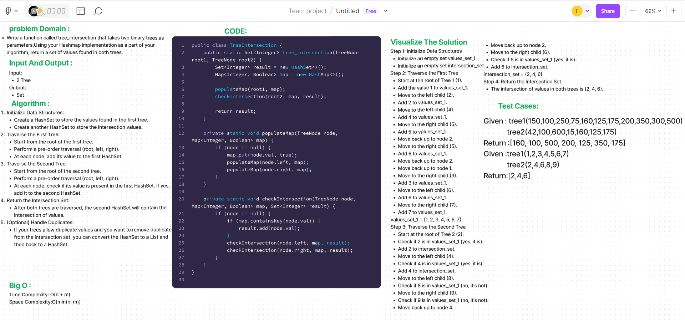

# Code Challenge: Class 32
The task is to find the common values present in two binary trees. This is done by traversing both trees and using a HashSet to keep track of the values in the first tree. Then, while traversing the second tree, if a value is found in the HashSet, it means it's present in both trees and is added to the result set. The algorithm's time complexity is O(n + m) where "n" and "m" are the number of nodes in the respective trees.


## Whiteboard Process


## Approach & Efficiency
Initialize two sets: values_set_1 to store values from the first tree, and intersection_set to store the intersection values.
Traverse the first tree in a pre-order manner, adding values to values_set_1.
Traverse the second tree in a pre-order manner, checking if the value is present in values_set_1. If yes, add it to intersection_set.
Optionally, convert intersection_set to a list and back to a set to remove duplicates.
Return the final intersection_set.
Time Complexity:

Traversing both trees takes O(n + m), where "n" and "m" are the number of nodes in the respective trees.
Checking for intersection and adding values to sets is done in constant time.
Space Complexity:

The space required is O(min(n, m)) to store the values from the smaller tree. This is because the HashSet will store at most min(n, m) unique values.
## Solution

```
public class TreeNode {
    int val;
    TreeNode left;
    TreeNode right;

    public TreeNode(int val) {
        this.val = val;
        this.left = null;
        this.right = null;
    }
}


public class TreeIntersection {
    public static Set<Integer> tree_intersection(TreeNode root1, TreeNode root2) {
        Set<Integer> result = new HashSet<>();
        Map<Integer, Boolean> map = new HashMap<>();

        populateMap(root1, map);
        checkIntersection(root2, map, result);

        return result;
    }

    private static void populateMap(TreeNode node, Map<Integer, Boolean> map) {
        if (node != null) {
            map.put(node.val, true);
            populateMap(node.left, map);
            populateMap(node.right, map);
        }
    }

    private static void checkIntersection(TreeNode node, Map<Integer, Boolean> map, Set<Integer> result) {
        if (node != null) {
            if (map.containsKey(node.val)) {
                result.add(node.val);
            }
            checkIntersection(node.left, map, result);
            checkIntersection(node.right, map, result);
        }
    }
}

```
