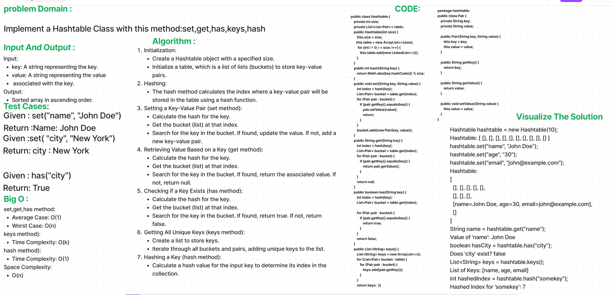

# Hash Table Implementation
Hashtable is a data structure that efficiently stores key-value pairs. It uses a hash function to determine where to store and retrieve data
on this code we just implement a Hash Table withs some method like : set,get,has ...
## Whiteboard Process

## Approach & Efficiency
Set Method: Inserts a key-value pair. Average time complexity is O(1), worst-case is O(n) due to collisions.

Get Method: Retrieves a value based on a key. Average time complexity is O(1), worst-case is O(n) due to collisions.

Has Method: Checks if a key exists. Average time complexity is O(1), worst-case is O(n) due to collisions.

Keys Method: Returns a list of unique keys. Time complexity is O(k), where k is the total number of keys.

Space complexity is O(n) due to the space needed for keys and values.

## Solution

```
public class Hashtable {
    private int size;
    private List<List<Pair>> table;

    public Hashtable(int size) {
        this.size = size;
        this.table = new ArrayList<>(size);

        for (int i = 0; i < size; i++) {
            this.table.add(new LinkedList<>());
        }
    }
    public int hash(String key) {
        return Math.abs(key.hashCode()) % size;
    }
    public void set(String key, String value) {
        int index = hash(key);
        List<Pair> bucket = table.get(index);

        for (Pair pair : bucket) {
            if (pair.getKey().equals(key)) {
                pair.setValue(value);
                return;
            }
        }

        bucket.add(new Pair(key, value));
    }
    public String get(String key) {
        int index = hash(key);
        List<Pair> bucket = table.get(index);

        for (Pair pair : bucket) {
            if (pair.getKey().equals(key)) {
                return pair.getValue();
            }
        }
        return null;
    }
    public boolean has(String key) {
        int index = hash(key);
        List<Pair> bucket = table.get(index);

        for (Pair pair : bucket) {
            if (pair.getKey().equals(key)) {
                return true;
            }
        }

        return false;
    }

    public List<String> keys() {
        List<String> keys = new ArrayList<>();

        for (List<Pair> bucket : table) {
            for (Pair pair : bucket) {
                keys.add(pair.getKey());
            }
        }

        return keys;
    }
}


public class Pair {
    private String key;
    private String value;

    public Pair(String key, String value) {
        this.key = key;
        this.value = value;
    }

    public String getKey() {
        return key;
    }

    public String getValue() {
        return value;
    }

    public void setValue(String value) {
        this.value = value;
    }
}
```
Input :
// Create a hashtable with a size of 10
Hashtable hashtable = new Hashtable(10);
// Set key-value pairs
hashtable.set("name", "John Doe");

Output :
Name: John Doe