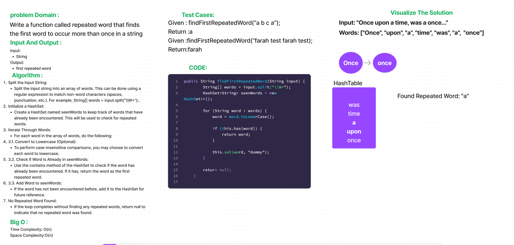

# First Word Repeated
The findFirstRepeatedWord function identifies the first repeated word in a given string of text, while ignoring case. It does this by using a hash table to keep track of encountered words. If a word is encountered more than once, it is returned as the first repeated word. If no repeated words are found, null is returned.

## Whiteboard Process


## Approach & Efficiency
The approach taken for findFirstRepeatedWord is as follows:

Split the input string into individual words.
Process each word, converting it to lowercase for case insensitivity.
Keep track of encountered words in a hash table.
If a word is encountered more than once, return it as the first repeated word.
Efficiency:

Time Complexity: O(n), where n is the number of words in the input string.
Space Complexity: O(n), due to the space used by the hash table.

## Solution

```
public String findFirstRepeatedWord(String input) {
        String[] words = input.split("\\W+");
        HashSet<String> seenWords = new HashSet<>();

        for (String word : words) {
            word = word.toLowerCase();

            if (this.has(word)) {
                return word;
            }

            this.set(word, "dummy");
        }

        return null;
    }

```